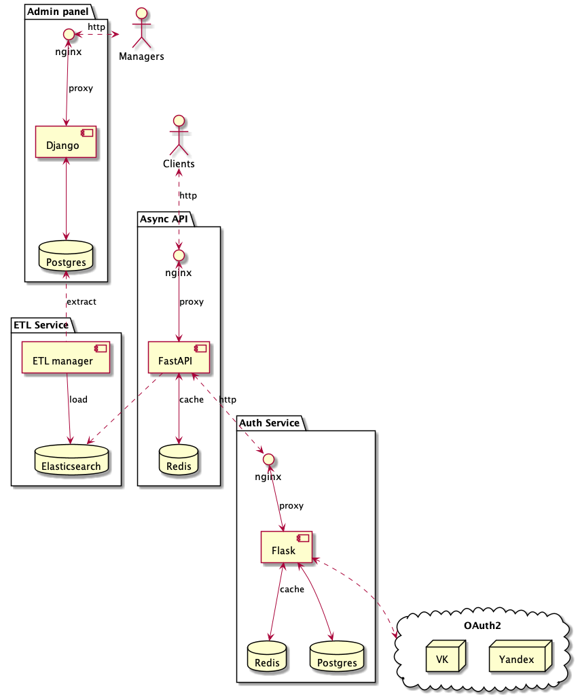

# Описание архитектуры

##1. Предыдущее состояние

 - Сервис состоит из четырех компонентов:
    - Панель администратора для управления контентом сайта;
    - ETL сервис для синхронизации данных между базами Postgres и ElasticSearch;
    - Сервис авторизации для работы для регистрации пользователей и разграничения прав по ролям;
    - Async API для доступа к контенту со стороны пользователей.

##2. Плановое состояние

- Планируется добавить сервис UGC для сбора данных о действиях пользователя с целью последующего анализа;

 - Компонент UGC состоит из четырех элементов:
    - Хранилище Kafka;
    - Хранилище ClickHouse;
    - UGC API для загрузки данных в Kafka;
    - ETL для выгрузки данных из Kafka и загрузки в ClickHouse.
 - Компонент UGC интегрирован с сервисом авторизации для валидации запросов.

##3. ADR

